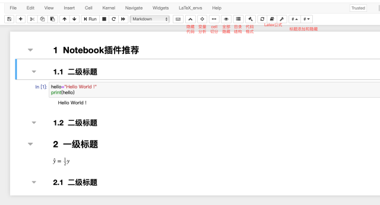
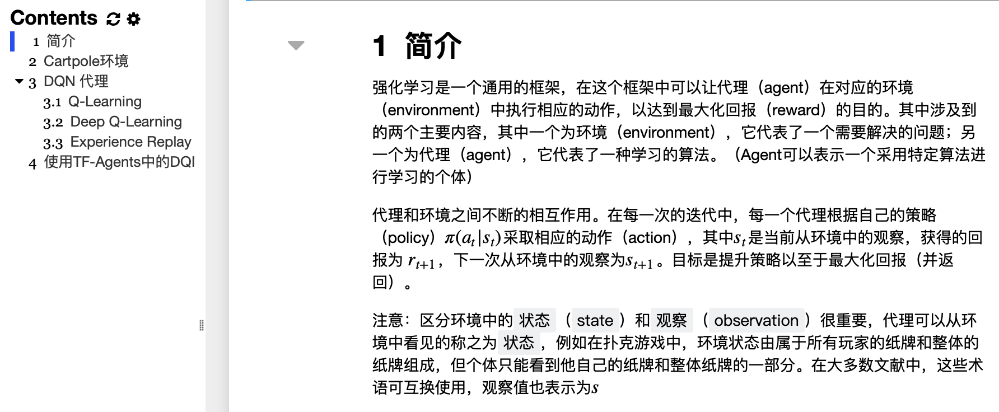
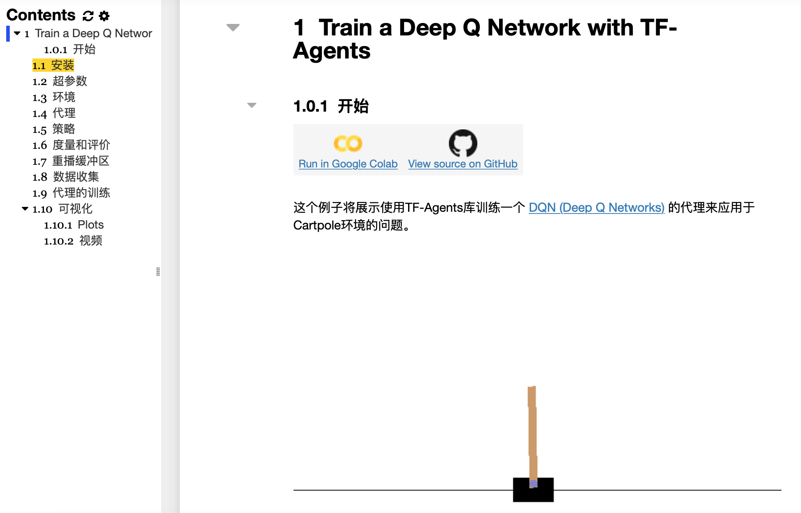
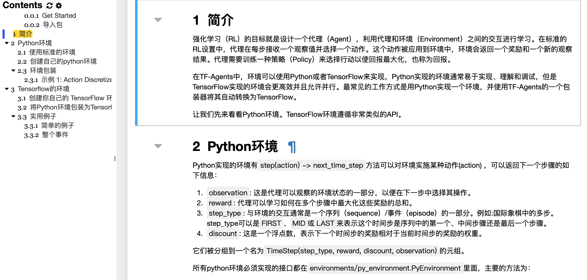
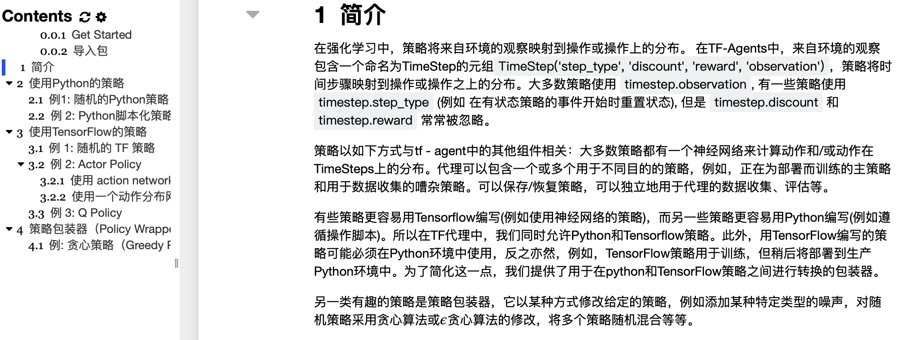
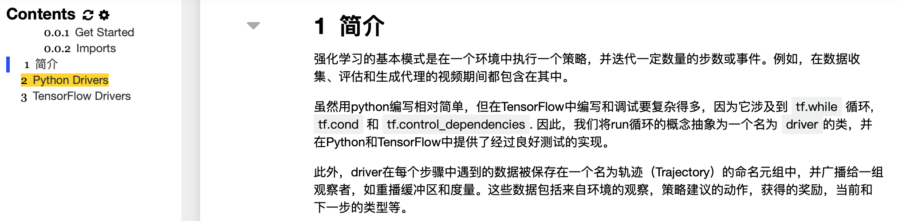
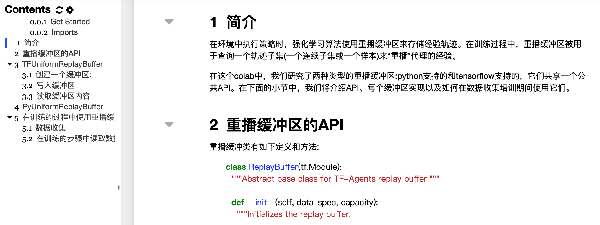

# RL-Notebook
 本项目提供了对google的tensorflow下的强化学框架的notebook中文翻译版本

原项目地址：https://github.com/tensorflow/agents


本项目使用jupyter notebook作为主要开发工具，其中涉及到一些Latex公式可能无法直接在其中显示，但安装一些插件之后将会使得jupyter notebook更加强大，具体安装教程链接如下：

**【神器】Noteboke好用的插件推荐**：https://mp.weixin.qq.com/s/hIDi0jwiPbaAuaWMbovRMQ




**教程目录**

- [TF-Agents: Tensorflow中强化学习的框架](#tf-agents--tensorflow--------)
  * [一、Agent（代理）](#--agent----)
  * [二、安装](#----)
  * [三、中文教程](#------)
    + [0.强化学习介绍](https://github.com/LIANGQINGYUAN/RL-Notebook/blob/master/tf-agent/0_intro_rl_cn.ipynb)
    + [1.TF-Agents训练DQN并应用于Cartpole的问题](https://github.com/LIANGQINGYUAN/RL-Notebook/blob/master/tf-agent/1_dqn_tutorial_cn.ipynb)
    + [2.TF-Agent中环境的使用](https://github.com/LIANGQINGYUAN/RL-Notebook/blob/master/tf-agent/2_environments_tutorial_cn.ipynb)
  * [四、引用](#----)


# TF-Agents: Tensorflow中强化学习的框架

## 一、Agent（代理）

在TF-Agent中，RL算法的核心元素被实现为Agent。 Agent承担两项主要职责：定义与环境交互的策略，以及如何从收集的经验中学习/训练该策略。

当前，TF-Agents提供以下算法：

- [DQN: **Human level control through deep reinforcement learning** Mnih et al., 2015](https://deepmind.com/research/dqn/)

- [DDQN: **Deep Reinforcement Learning with Double Q-learning** Hasselt et al., 2015](https://arxiv.org/abs/1509.06461)

- [DDPG: **Continuous control with deep reinforcement learning** Lillicrap et al., 2015](https://arxiv.org/abs/1509.02971)

- [TD3: **Addressing Function Approximation Error in Actor-Critic Methods** Fujimoto et al., 2018](https://arxiv.org/abs/1802.09477)

- [REINFORCE: **Simple Statistical Gradient-Following Algorithms for Connectionist Reinforcement Learning**Williams, 1992](http://www-anw.cs.umass.edu/~barto/courses/cs687/williams92simple.pdf)

- [PPO: **Proximal Policy Optimization Algorithms** Schulman et al., 2017](https://arxiv.org/abs/1707.06347)

- [SAC: **Soft Actor Critic** Haarnoja et al., 2018](https://arxiv.org/abs/1812.05905)

## 二、安装

安装命令

```
# Installing with the `--upgrade` flag ensures you'll get the latest version.
pip install --user --upgrade tf-agents-nightly  # depends on tf-nightly
```

  

## 三、中文教程

### [0.强化学习介绍](https://github.com/LIANGQINGYUAN/RL-Notebook/blob/master/tf-agent/0_intro_rl_cn.ipynb)




### [1.TF-Agents训练DQN并应用于Cartpole的问题](https://github.com/LIANGQINGYUAN/RL-Notebook/blob/master/tf-agent/1_dqn_tutorial_cn.ipynb)



### [2.TF-Agent中环境的使用](https://github.com/LIANGQINGYUAN/RL-Notebook/blob/master/tf-agent/2_environments_tutorial_cn.ipynb)




### [3.TF-Agent中策略的使用]()




### [4.TF-Agent中driver的使用]()




### [5TF-Agent中Replay Buffer的使用]()




持续更新中·····


## 四、引用

请使用原仓库中的引用：

```
@misc{TFAgents,
  title = {{TF-Agents}: A library for Reinforcement Learning in TensorFlow},
  author = "{Sergio Guadarrama, Anoop Korattikara, Oscar Ramirez,
    Pablo Castro, Ethan Holly, Sam Fishman, Ke Wang, Ekaterina Gonina, Neal Wu,
    Efi Kokiopoulou, Luciano Sbaiz, Jamie Smith, Gábor Bartók, Jesse Berent,
    Chris Harris, Vincent Vanhoucke, Eugene Brevdo}",
  howpublished = {\url{https://github.com/tensorflow/agents}},
  url = "https://github.com/tensorflow/agents",
  year = 2018,
  note = "[Online; accessed 25-June-2019]"
}
```
