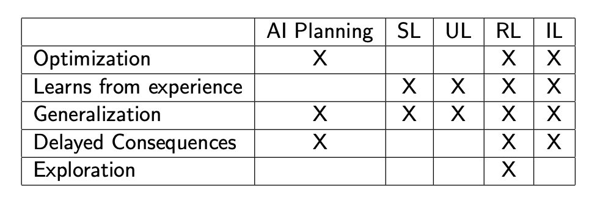
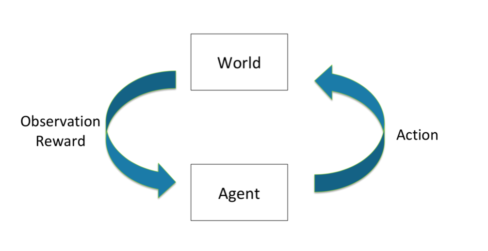
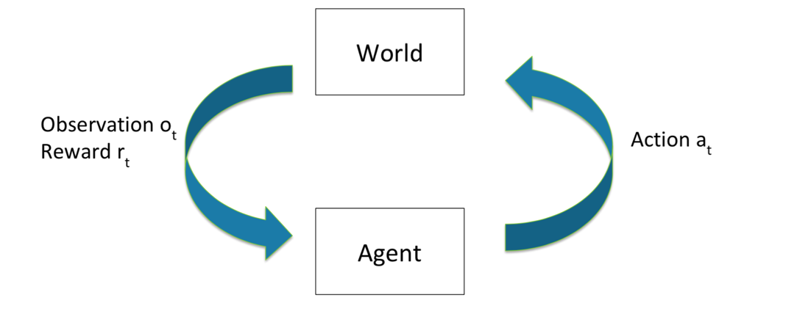
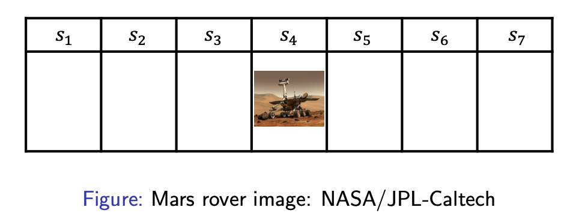
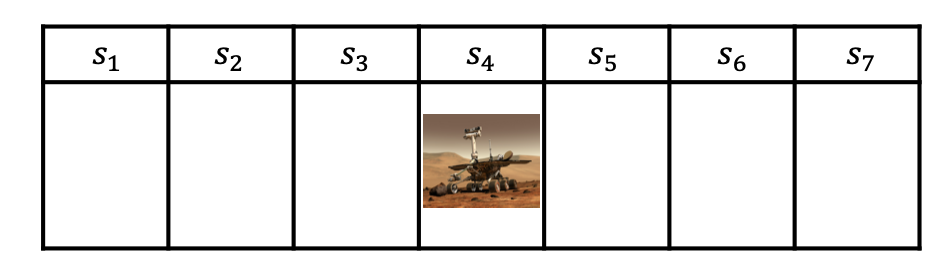
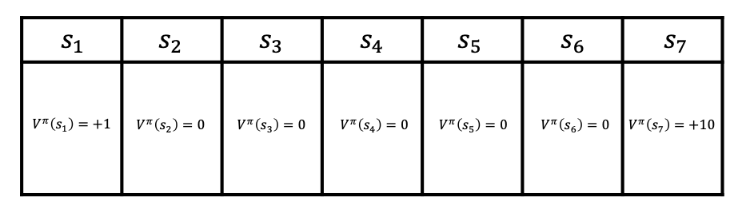
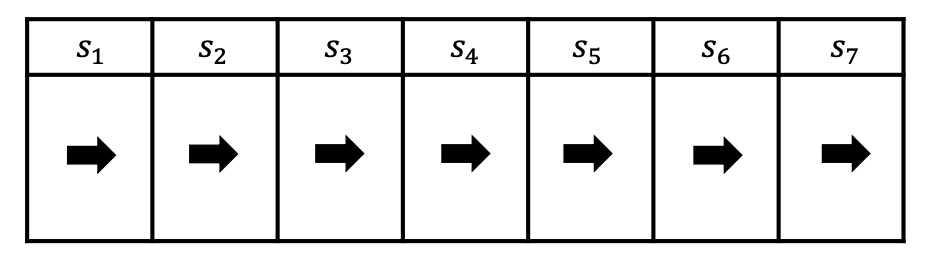
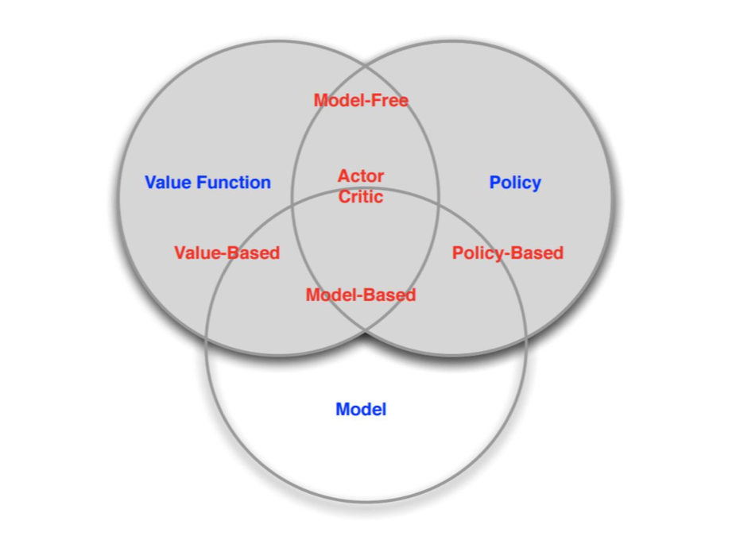

# 1. Overview of reinforcement learning

Fundamental challenge in artificial intelligence and machine learning is learning to make good decisions under uncertainty.

>SL = Supervised learning; 
>
>UL = Unsupervised learning; 
>
>RL = Reinforcement Learning; 
>
>IL = Imitation Learning

Reinforcement Learning Involves

- Optimization
  - Goal is to find an optimal way to make decisions 
  - Yielding best outcomes or at least very good outcomes
- Delayed consequences 
  - Decisions now can impact things much later...
  - Introduces two challenges
- Exploration 
  - Learning about the world by making decisions
    - Agent as scientist
    - Learn to ride a bike by trying (and failing)
  - Censored data
    - Only get a reward (label) for decision made
    - Don’t know what would have happened
  - Decisions impact what we learn about
- Generalization
  - Policy is mapping from past experience to action

How Do We Proceed?

- Explore the world
- Use experience to guide future decisions

Application:

- Chat Robot
- Text Generation
- Flying Helicopter
- Driving
- Playing Video Game

# 2. Course structure overview

High Level Learning Goals*:

- Define the key features of RL
- Given an application probem how (and whether) to use RL for it 
- Compare and contrast RL algorithms on multiple criteria
- *For more detailed descriptions, see website

# 3. Introduction to sequential decision making under uncertainty

- Goal: Select actions to maximize total expected future reward

- May require balancing immediate & long term reward

## 3.1 Sequential Decision Process: Agent & the World (Discrete Time)

Each time step $t$:

- Agent takes an action $a_t$

- World updates given action $a_t$, emits observation $o_t$ and reward $r_t$

- Agent receives observation $o_t$ and reward $r_t$

History $h_t = (a_1,o_1,r_1,...,a_t,o_t,r_t)$

Agent chooses action based on history

**State is information assumed to determine what happens next**

- Function of history: $s_t = (h_t )$

> state:  the state is part of the observed environment, not the state of the Agent. If it is the state of the Agent, there will be no situation where the Agent does not know.

**World State**

- This is true state of the world **used to determine how world generates** next observation and reward.

- Often hidden or unknown to agent.

- Even if known may contain information not needed by agent.

**Agent State: Agent’s Internal Representation**

- What the agent / algorithm **uses to make decisions about how to act**
- Generally a function of the history: $s_t = f (h_t )$

- Could include meta information like state of algorithm (how many computations executed, etc) or decision process (how many decisions left until an episode ends)

## 3.2 Markov Decision Process (MDP)

Markov Assumption

- Information state: sufficient statistic of history

- State $s_t$ is Markov if and only if:

  $p(s_{t+1}|s_t , a_t ) = p(s_{t+1}|h_t , a_t )$

- Future is independent of past given present

> state: Current local environment status (observable / received by sensors). If you look at the historical state of a long time, you may know where the current Agent(such as a robot) is; but if you only look at the current state, you will not be able to determine the location and other information, because there may be a lot of the same (overlapping) state .

Examples of NOT a Markov system :

Hypertension control: let state be current blood pressure, and action be whether to take medication or not.（It is not a Markov process, because blood pressure is also related to whether it is exercised, the temperature of the external environment; it violates the first assumption）

Website shopping: state is current product viewed by customer, and action is what other product to recommend. 

**Why is Markov Assumption Popular?**

- Can always be satisfied
  - Setting state as history always Markov: $s_t = h_t$
- **In practice** often assume most recent observation is sufficient statistic of history:$s_t = o_t$

- State representation has big implications for:
  - Computational complexity
  - Data required
  - Resulting performance

## 3.3 Example: Mars Rover as a Markov Decision Process

- States: Location of rover (s1, . . . , s7)

- Actions: TryLeft or TryRight

- Rewards:
  - +1 in state s1
  - +10 in state s7
  - 0 in all other states

- RL Algorithm Components:
  - Often includes one or more of: Model, Policy, Value Function

**1) MDP Model**

Agent’s representation of how world changes given agent’s action

Transition / dynamics model predicts next agent state

- $p(s_{t+1} =s′ |s_t =s,a_t =a)$

Reward model predicts immediate reward

- $r(s_t =s,a_t =a)=\mathbb{E}[r_t|s_t =s,a_t =a]$

**2) Policy**

Policy $\pi$ determines how the agent chooses actions

$\pi:S\rightarrow A$, mapping from states to actions

Deterministic policy:

- $π(s) = a$

Stochastic policy:

- $\pi (a|s) = Pr(a_t = a|s_t = s)$

$π(s_1) = π(s_2) = ··· = π(s_7) = TryRight$

**3) Value Function**

Value function$ V^π$: expected discounted sum of future rewards under a particular policy $ π$

$V^π(s_t =s)=\mathbb{E}_π[r_t +γr_{t+1} +γ^2r_{t+2} +γ^3r_{t+3} +···|s_t =s]$

Discount factor $\gamma$ weighs immediate vs future rewards

Can be used to quantify goodness/badness of states and actions

And decide how to act by comparing policies

Discount factor, $γ = 0$

$π(s_1) = π(s_2) = ··· = π(s_7) = TryRight$

Numbers show value $V^π(s)$ for this policy and this discount factor

**Evaluation and Control**

Evaluation

- Estimate/predict the expected rewards from following a given policy

Control

- Optimization: find the best policy

**Types of RL Agents**

Model-based 

- Explicit: Model

- May or may not have policy and/or value function 

Model-free

- Explicit: Value function and/or policy function 
- No model

